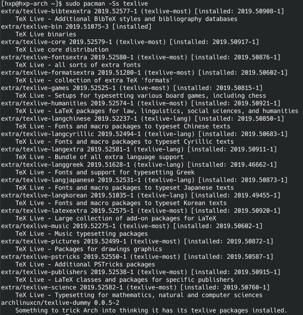
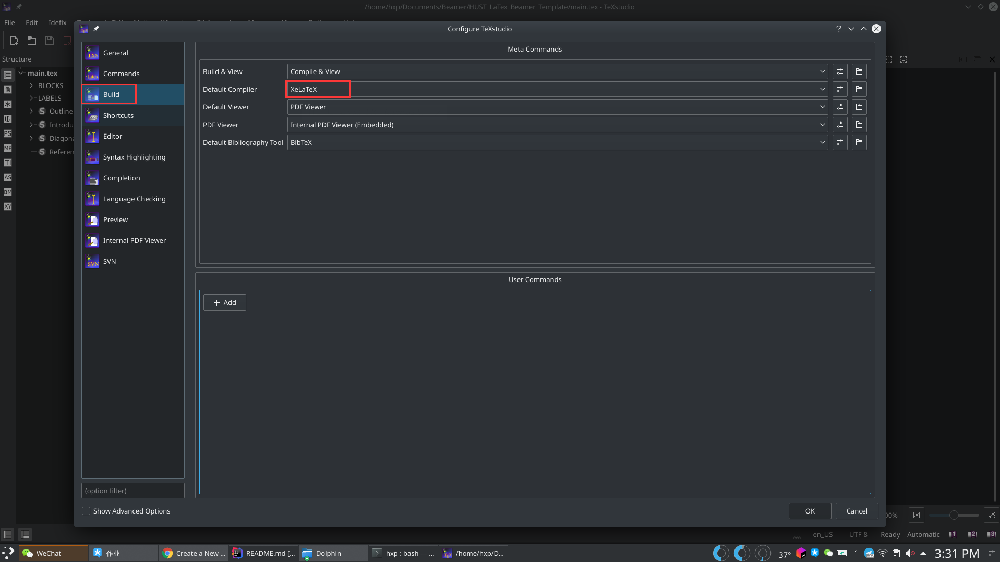
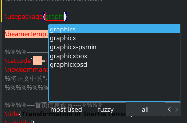
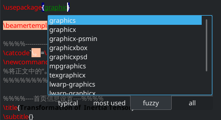

# The Deployment of LaTeX Dev Env
# LaTeX开发环境的部署

## Tex Live + TeXStudio环境的安装
### 对于广大Windows用户
#### 安装TeX Live环境
下载安装包大约3点多个G，因此为了快速下载不推荐去国外的地址下载。在这里提供一个清华大学的镜像站，[点击这里](mirrors.tuna.tsinghua.edu.cn/CTAN/systems/texlive/Images/texlive2019-20190410.iso)直接下载，下载过程大约20分钟。

下载完成之后是iso磁盘镜像文件，不推荐用压缩软件解压。用Win10的资源管理器打开。这么做的目的有两方面：首先是解压浪费时间，其次是解压浪费磁盘空间。直接令Windows创建虚拟磁盘然后挂载镜像是最好的方式。

双击install-tl-windows安装，UAC管理员权限弹窗请允许。当然我的Win10设置了UAC永不弹窗，为了方便。

安装完记得umount

#### 安装TeXStudio
去GitHub下载TeXStudio [点击前往GitHub](https://github.com/texstudio-org/texstudio)

考虑到有相当一部分人连GitHub都不会使，连下个安装程序都不会，我还是在这里说一下吧
点这里

再点这个

### 对于像我这样的少数Linux用户
以Arch Linux为例，直接在包管理器里面搜索texlive和texstudio然后安装。

TeX Live检索结果

TeXStudio检索结果

运行`sudo pacman -S texlive-most texlive-lang texstudio`然后等待安装完成

## TeXStudio安装的后期配置
首先，更改默认编译器为XeLaTeX。因为XeLaTeX支持中文。
Options -> Configure TeXStudio里

之后建议默认自动补全设置为模糊

设置的前后对比

 

这样做对于初学者是友好的，尤其是记不住包名和指令的人。

~~下边这个Windows用户可以忽略~~

语法高亮配色的选取：众所周知，IDE设置一个好的语法高亮不仅能更清楚地区分代码中的语法成分，还能防止疲劳。在这里设置

**进阶技巧：Hack字体的配置**

好的字体能在美观的同时方便程序员区分l，I，和1。Hack字体是一种开源字体，被认为是比Consolas更好的最佳变成字体。

[点击这里跳转到Hack字体的GitHub主页](https://github.com/source-foundry/Hack)

[点击这里下载Windows字体安装程序](https://github.com/source-foundry/Hack-windows-installer/releases/tag/v1.6.0)

安装字体后重启，在这里启用字体

